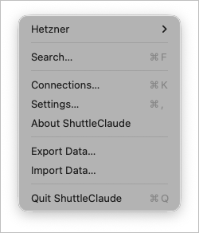
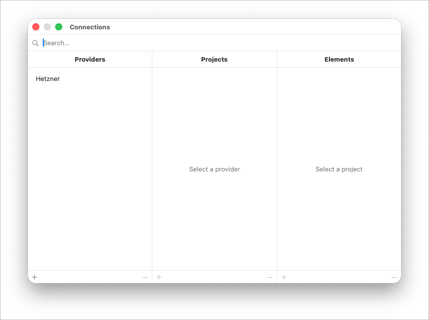
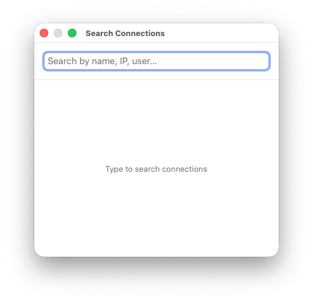
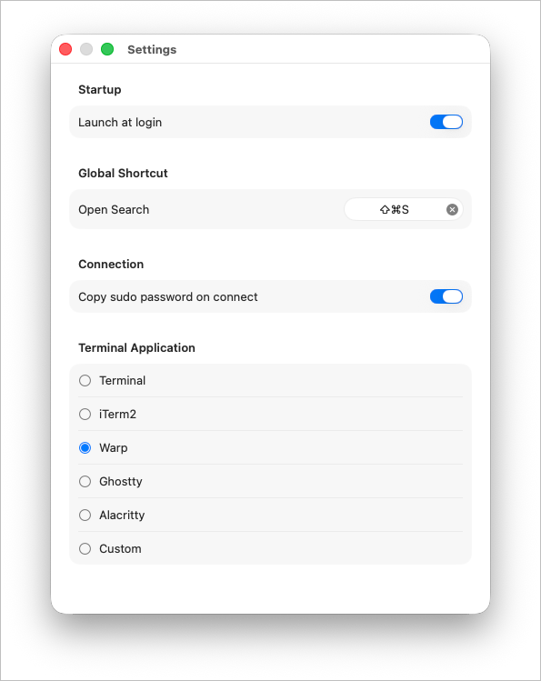

# ShuttleClaude

> 🖥️ SSH connection manager for macOS that lives in your menu bar. Organize your servers by provider and project, then connect with a single click.

[](https://www.apple.com/macos/)
[](https://swift.org/)
[](LICENSE)
[](https://www.warp.dev/)

> 💡 **Warp support** — Unlike most SSH managers, ShuttleClaude has **full native support for [Warp](https://www.warp.dev/)**, the modern Rust-based terminal. Connect to your servers directly in Warp with a single click.

## Screenshots

| Menu Bar | Connections |
|:---:|:---:|
|  |  |

| Search | Settings |
|:---:|:---:|
|  |  |

## ✨ Features

- 📌 **Menu bar app** — always accessible, no Dock icon
- 📂 **Organize connections** in a Provider > Project > Element hierarchy
- 🔍 **Quick search** — find connections by name, IP, host, or user (global shortcut: `Cmd+Shift+S`)
- 🖥️ **Multiple terminals** — supports Terminal.app, iTerm2, **Warp**, and custom terminals
- 🔑 **Sudo password management** — store sudo passwords per connection, auto-copy to clipboard on connect
- 🔗 **Project URLs** — attach a URL to each project for quick reference
- 📝 **Notes** — add free-text notes to any connection
- 🚀 **Launch at login** — optionally start the app when your Mac boots
- ⌨️ **Configurable global hotkey** — open the search window from any app (default: `Cmd+Shift+S`)
- 🧭 **Keyboard navigation** — arrow keys and Enter to navigate and connect
- 💾 **Export / Import** — export all data to JSON (sudo passwords encrypted with AES-GCM), import with replace or merge option
- 🗄️ **Data persistence** — all data saved locally in JSON format

## 📋 Requirements

- macOS 13.0 or later
- [Xcode 15.0](https://developer.apple.com/xcode/) or later (required to build the project)

## 🔨 Build

1. Clone the repository:

```bash
git clone https://github.com/rafa1944/shuttle-claude.git
cd shuttle-claude
```

2. Resolve Swift Package dependencies:

```bash
xcodebuild -resolvePackageDependencies -scheme ShuttleClaude
```

3. Build the project:

```bash
xcodebuild -scheme ShuttleClaude -configuration Release build
```

The built app will be located in `~/Library/Developer/Xcode/DerivedData/ShuttleClaude-*/Build/Products/Release/ShuttleClaude.app`.

Alternatively, open `ShuttleClaude.xcodeproj` in Xcode and press Cmd+B to build or Cmd+R to build and run.

## 🚀 Run

- **From Xcode**: Open the project and press Cmd+R
- **From terminal**: `open /path/to/ShuttleClaude.app`
- **Manual install**: Copy `ShuttleClaude.app` to `/Applications` and launch it from there

Once running, the app appears as a terminal icon in the menu bar.

## 🔐 Permissions

On macOS 13+, the system will prompt you to grant the following permissions the first time you use certain features:

- **Accessibility** (System Settings > Privacy & Security > Accessibility) — required for the global keyboard shortcut to work from any app. macOS will show a prompt the first time you set a global hotkey.
- **Automation** (System Settings > Privacy & Security > Automation) — required to open SSH sessions in your terminal. macOS will ask you to allow ShuttleClaude to control Terminal.app, iTerm2, or Warp the first time you connect.

If the app is not working as expected, check that both permissions are enabled in **System Settings > Privacy & Security**.

## 📖 Usage

1. Click the terminal icon in the menu bar
2. Go to **Settings** (`Cmd+,`) to configure your preferred terminal
3. Open **Connections** (`Cmd+K`) to add your providers, projects, and connections
4. Click any connection in the menu to open an SSH session
5. Use **Search** (`Cmd+F` from menu, or the global shortcut) to quickly find and connect

## 🗄️ Data Storage

Connection data is stored at:

```
~/Library/Application Support/ShuttleClaude/shuttle_data.json
```

## 📦 Dependencies

- [KeyboardShortcuts](https://github.com/sindresorhus/KeyboardShortcuts) by Sindre Sorhus — global keyboard shortcut support

## 👤 Author

Rafa Alcantara — rafa.alcantara@gmail.com

## 📄 License

MIT License

Copyright (c) 2026 Rafa Alcantara

Permission is hereby granted, free of charge, to any person obtaining a copy
of this software and associated documentation files (the "Software"), to deal
in the Software without restriction, including without limitation the rights
to use, copy, modify, merge, publish, distribute, sublicense, and/or sell
copies of the Software, and to permit persons to whom the Software is
furnished to do so, subject to the following conditions:

The above copyright notice and this permission notice shall be included in all
copies or substantial portions of the Software.

THE SOFTWARE IS PROVIDED "AS IS", WITHOUT WARRANTY OF ANY KIND, EXPRESS OR
IMPLIED, INCLUDING BUT NOT LIMITED TO THE WARRANTIES OF MERCHANTABILITY,
FITNESS FOR A PARTICULAR PURPOSE AND NONINFRINGEMENT. IN NO EVENT SHALL THE
AUTHORS OR COPYRIGHT HOLDERS BE LIABLE FOR ANY CLAIM, DAMAGES OR OTHER
LIABILITY, WHETHER IN AN ACTION OF CONTRACT, TORT OR OTHERWISE, ARISING FROM,
OUT OF OR IN CONNECTION WITH THE SOFTWARE OR THE USE OR OTHER DEALINGS IN THE
SOFTWARE.
